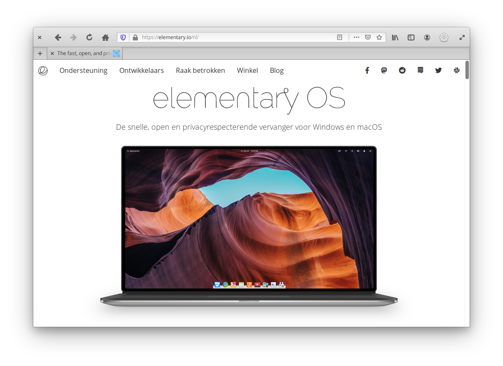
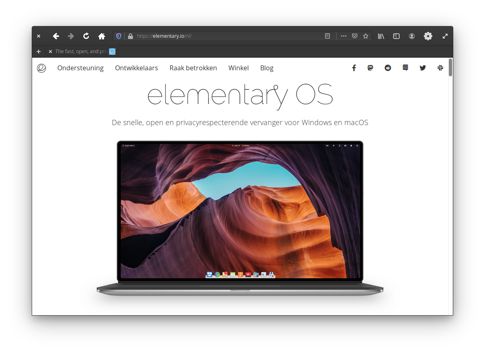
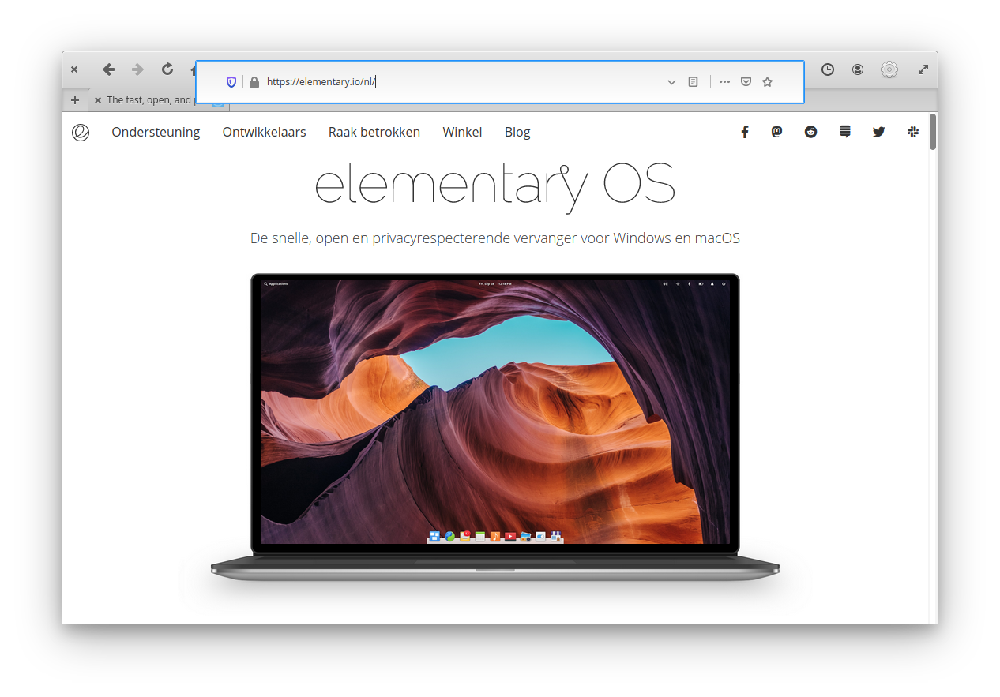

# An elementary os theme for Firefox

## Credits
Credits to [Harvey Cabaguio](https://github.com/harveycabaguio/firefox-elementary-theme) for setting the theme up, [h1royuki](https://github.com/h1royuki/firefox-elementary-theme) for the dark mode and the elementary team for the UI design and icons.

## Install
Firefox does not support userChrome.css by default. Here are the steps to make it work:
1. Load about:config in the Firefox address bar.
2. Confirm that you will be careful.
3. Search for `toolkit.legacyUserProfileCustomizations.stylesheets` using the search at the top.
4. Toggle the preference by double clicking. True means Firefox supports the CSS files, False that it ignores them.

Follow these steps to install userChrome.css:
1. Go to [about:support](about:support) in Firefox
2. Application Basics > Profile Directory > Open Directory
3. Create a folder named `chrome`
4. Paste the userChrome.css in this folder
5. Disable Title bar in the customization panel in Firefox.
5. In the customization panel in Firefox you can move the new tab button to the left if you wish and use the dark mode option as well.

## Notes
For **Firefox Nightly** and **Firefox Developer Edition** use ``userChrome.css`` in nightly folder.
See this post 

## Megabar activation
If you would like to use the new Megabar, take the following steps:
1. Load about:config in the Firefox address bar.
2. Confirm that you will be careful.
3. Search for `browser.urlbar.megabar` using the search at the top.
4. Toggle the preference by double clicking.
