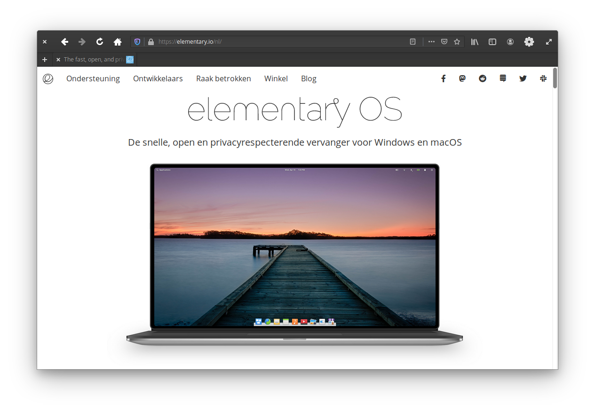
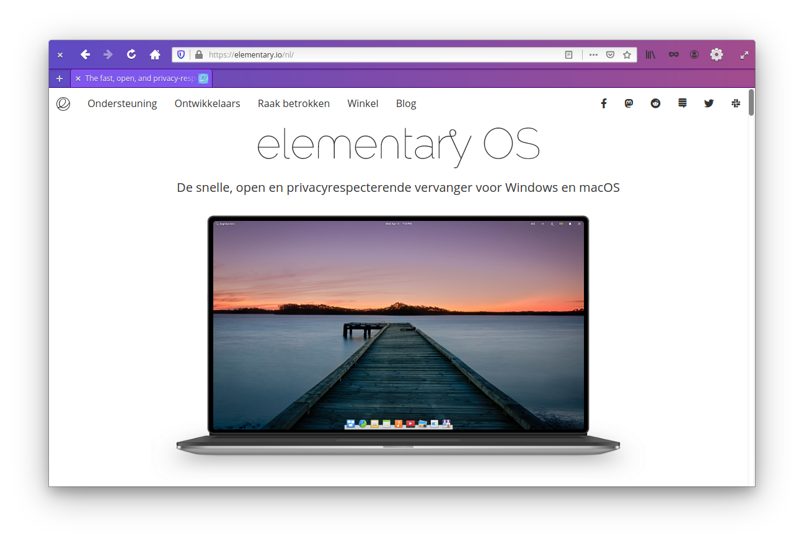

# An elementary OS theme for Firefox





## Credits

Credits to [Harvey Cabaguio](https://github.com/harveycabaguio/firefox-elementary-theme) for setting the theme up, [DRHAX34](https://github.com/DRHAX34) and [sempasha](https://github.com/sempasha) for the install script and the elementary team for the UI design and icons.

## Install

**Firefox does not support userChrome.css by default. Here are the steps to make it work:**

  1. Load **about:config** in the Firefox address bar.
  2. Confirm that you will be careful.
  3. Search for `toolkit.legacyUserProfileCustomizations.stylesheets` using the search at the top.
  4. Toggle the preference by double clicking. True means Firefox supports the CSS files, False that it ignores them.

**Follow this step to install the userChrome.css:**

Use this one line install script which let you select the window buttons layout you like:

```bash
curl -s -o- https://raw.githubusercontent.com/Zonnev/elementaryos-firefox-theme/master/install.sh | bash
```
Just copy the line to your terminal and press enter. Then it lets you choose which window buttons layout you need (1-8) and press enter again.

## After installation

1. Disable Title bar in the customization panel in Firefox. 
2. In the customization panel in Firefox you can move the new tab button to the left if you wish and use the dark mode option as well, in combination with [Tweaks](https://github.com/elementary-tweaks/elementary-tweaks).
