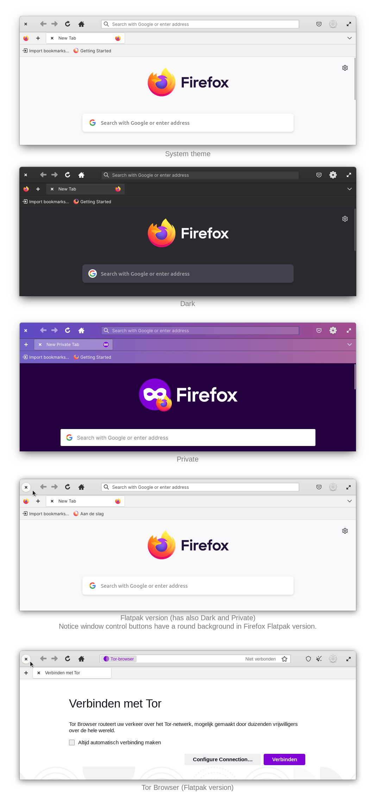

# An elementary OS theme for Firefox

## 🙏 Credits

Credits to [Harvey Cabaguio](https://github.com/harveycabaguio/firefox-elementary-theme) for setting the theme up, [Surendrajat](https://github.com/Surendrajat), [DRHAX34](https://github.com/DRHAX34) and [sempasha](https://github.com/sempasha) for the install script and the elementary team for the UI design and icons.

## ⬇️ Install

For now theme installation is supported for:

1. [🦊 Firefox](https://www.mozilla.org/en-US/firefox/new/) installed with apt package manager.
   To install it run command `sudo apt install firefox` with your Terminal.
2. [🦊 Firefox Nightly](https://www.mozilla.org/en-US/firefox/channel/desktop/#nightly)
   installed with apt package manager.
3. [🦊 Firefox 📦 Flatpak version](https://flathub.org/apps/details/org.mozilla.firefox).
3. [🦊 Firefox 📦 Snap version](https://snapcraft.io/firefox).
4. [🐺 Librewolf Appimage version](https://librewolf.net/installation/linux/).
5. [🐺 Librewolf 📦 Flatpak version](https://flathub.org/apps/details/io.gitlab.librewolf-community).
6. [🧅 Tor Browser](https://community.torproject.org/onion-services/setup/install/).
7. [🧅 Tor Browser 📦 Flatpak version](https://flathub.org/apps/details/com.github.micahflee.torbrowser-launcher).

❗*For best experience we recommend to use theme with Firefox installed with apt package manager.*
*Other installations have limited support. [We also welcome contributions](https://github.com/Zonnev/elementaryos-firefox-theme/blob/elementaryos-firefox-theme/CONTRIBUTING.md) like editing a userChrome,*
*for example to make a fully supported other version possible. Thanks in advance.*

Use this one line install script which let you select the window buttons layout you like:

```bash
bash <(wget --quiet --output-document - "https://raw.githubusercontent.com/Zonnev/elementaryos-firefox-theme/elementaryos-firefox-theme/install.sh")
```

Just copy the line to your terminal and press enter.
Script also supports 10 different window controls layouts which you may choose with
[Pantheon Tweaks](https://github.com/pantheon-tweaks/pantheon-tweaks/).

To force installation of Titlebar Enabled Theme, use script below:

```bash
bash <(wget --quiet --output-document - "https://raw.githubusercontent.com/Zonnev/elementaryos-firefox-theme/elementaryos-firefox-theme/install.sh") --native-titlebar yes
```

Installation script will also patch Firefox preference to enable native titlebar usage.
Firefox doesn't use native titlebar by default.

To force installation of Private Mode Style, use script:

```bash
bash <(wget --quiet --output-document - "https://raw.githubusercontent.com/Zonnev/elementaryos-firefox-theme/elementaryos-firefox-theme/install.sh") --private-mode-style
```

This will make purple colors of Private Mode as default style.

## ➕ After installation

1. In the customization panel in Firefox you can move the new tab button to the left and select System theme. You can also use the dark theme option but light theme is not supported.
2. If you use [Pantheon Tweaks](https://github.com/pantheon-tweaks/pantheon-tweaks/) with the dark mode on, the theme changes to dark mode by itself. Firefox 98 and newer are changing to dark mode when the elementary OS system dark mode is set.

## 🔁 Update

To update installed theme, use script

```bash
bash <(wget --quiet --output-document - "https://raw.githubusercontent.com/Zonnev/elementaryos-firefox-theme/elementaryos-firefox-theme/install.sh") --update
```
