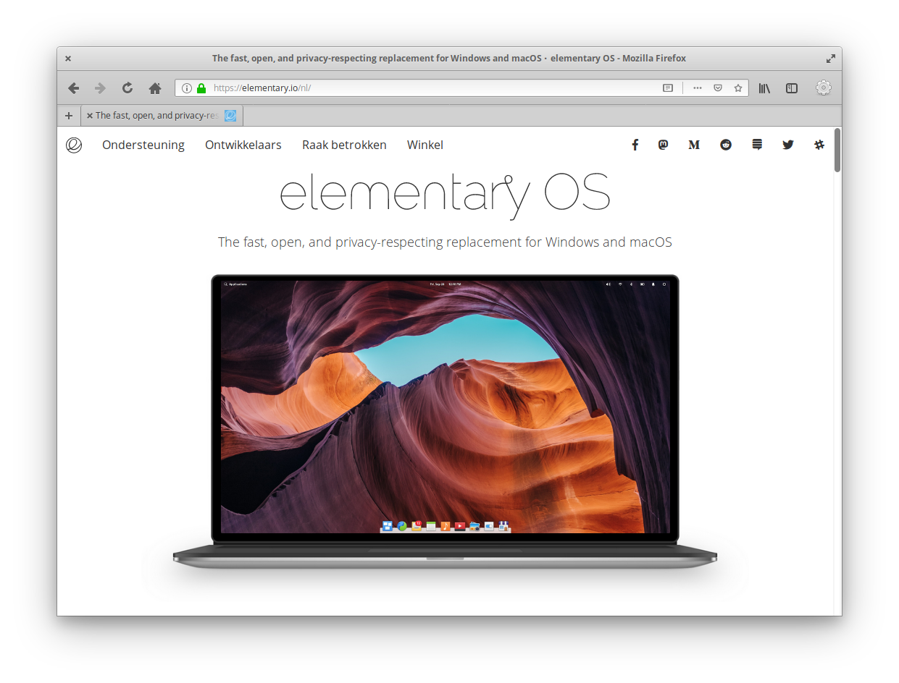

# An elementary os theme for Firefox 65+

## Usage
Use this theme with the titlebar option on.

## Credits
Credits to the elementary team for the UI design and icons.

## Install
1. Go to [about:support](about:support) in Firefox
2. Application Basics > Profile Directory > Open Directory
3. Create a folder named `chrome`
4. Paste the userChrome.css in this folder
