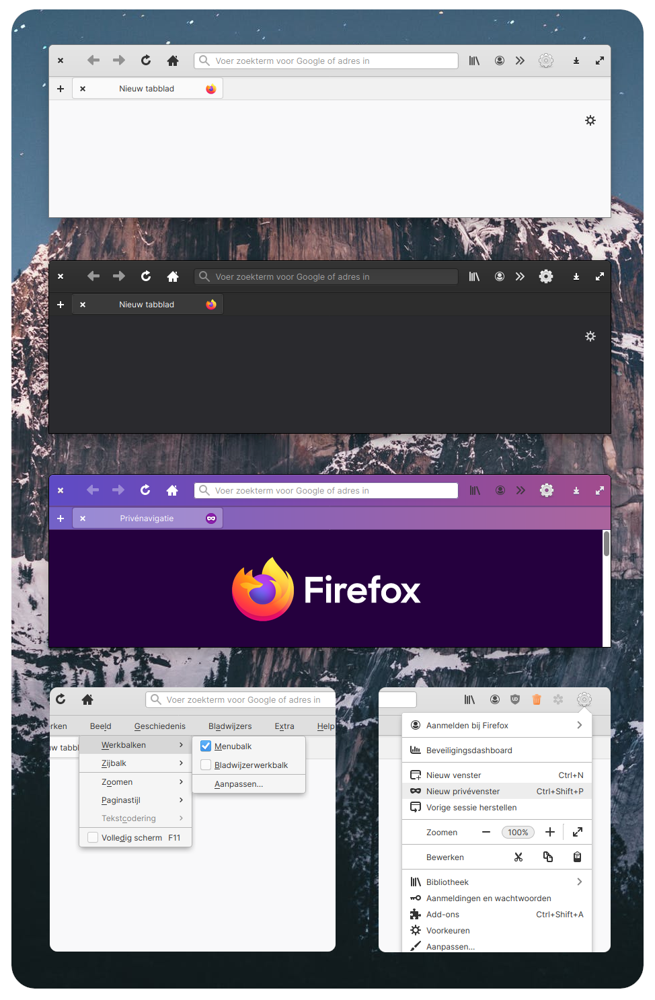

# An elementary OS theme for Firefox


## Credits

Credits to [Harvey Cabaguio](https://github.com/harveycabaguio/firefox-elementary-theme) for setting the theme up, [Surendrajat](https://github.com/Surendrajat), [DRHAX34](https://github.com/DRHAX34) and [sempasha](https://github.com/sempasha) for the install script and the elementary team for the UI design and icons.

## Install

I recommend installing Firefox in the terminal, typing: `sudo apt install firefox`, because Firefox in the Appcenter is a flatpak version which doesn't work well with the userChrome of this theme.

**Firefox does not support userChrome.css by default. Here are the steps to make it work:**

  1. Load **about:config** in the Firefox address bar.
  2. Confirm that you will be careful.
  3. Search for `toolkit.legacyUserProfileCustomizations.stylesheets` using the search at the top.
  4. Toggle the preference by double clicking. True means Firefox supports the CSS files, False that it ignores them.

**Follow this step to install the userChrome.css:**

You can set 10 different window buttons layouts with [Pantheon Tweaks](https://github.com/pantheon-tweaks/pantheon-tweaks/). Now it's possible to install this theme to match these window button layouts.

Use this one line install script which let you select the window buttons layout you like:

```bash
curl -s -o- https://raw.githubusercontent.com/Zonnev/elementaryos-firefox-theme/elementaryos-firefox-theme/install.sh | bash
```
Just copy the line to your terminal and press enter. Then it lets you choose which window buttons layout you need (1-10) and press enter again. If you don't want to install Pantheon Tweaks, then you select the Elementary layout (option 1 in the installer).

I have added two extra styles of the theme. Option 11 in the installer will install the theme version with Titlebar Enabled (enable the titlebar for this version). Option 12 in the installer will install the Private Mode Style (purple colours) as the default style. Please note that the Private Mode Style is made only for the Elementary button layout.

## After installation

1. Disable Title bar in the customization panel in Firefox.
2. In the customization panel in Firefox you can move the new tab button to the left and select System theme. You can also use the dark theme option but light theme is not supported.
3. If you use [Pantheon Tweaks](https://github.com/pantheon-tweaks/pantheon-tweaks/) with the dark mode on, the theme changes to dark mode by itself.
