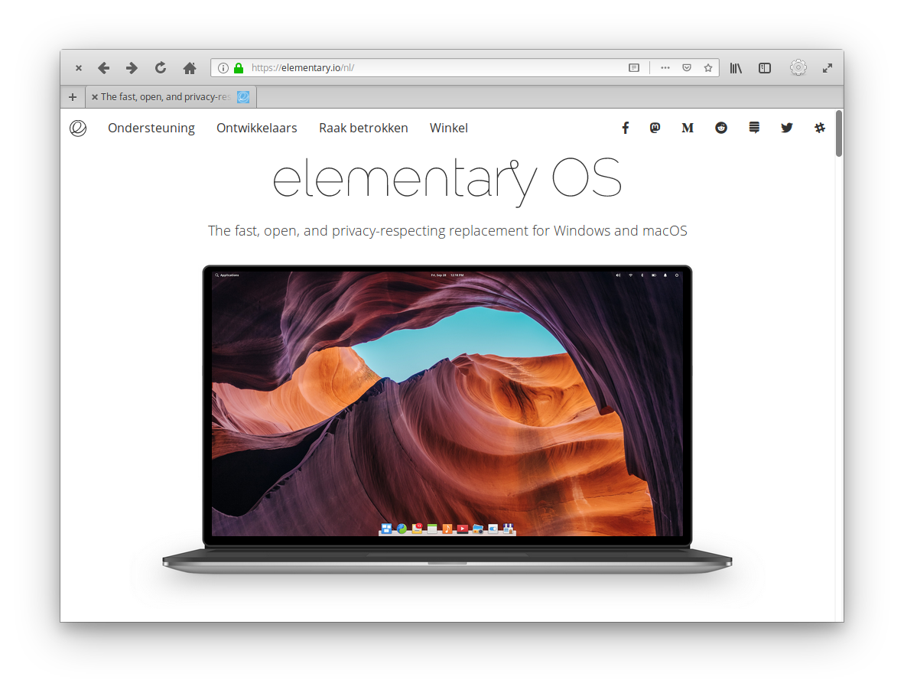

# An elementary os theme for Firefox 65+

## Issues
There is an issue with this theme:
If you use the bookmark bar, the window controls will go down as well.

## Credits
Credits to [Harvey Cabaguio](https://github.com/harveycabaguio/firefox-elementary-theme) and the elementary team for the UI design and icons.

## Install
1. Go to [about:support](about:support) in Firefox
2. Application Basics > Profile Directory > Open Directory
3. Create a folder named `chrome`
4. Paste the userChrome.css in this folder
