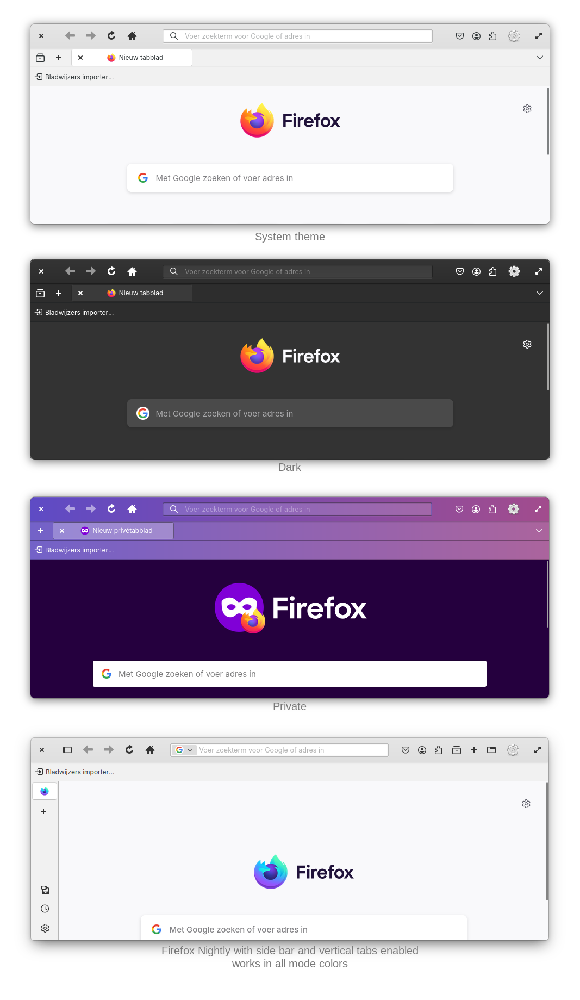

# An elementary OS theme for Firefox

## 🙏 Credits

Credits to [Harvey Cabaguio](https://github.com/harveycabaguio/firefox-elementary-theme) for setting the theme up, [sempasha](https://github.com/sempasha) and [Ryo Nakano](https://github.com/ryonakano) for the install script and the elementary team for the UI design and icons.

## ⬇️ Install

For now theme installation is supported for:

1. [🦊 Firefox 📦 Flatpak version](https://flathub.org/apps/details/org.mozilla.firefox).
2. [🦊 Firefox 📦 Snap version](https://snapcraft.io/firefox).
3. [🐺 Librewolf 📦 Flatpak version](https://flathub.org/apps/details/io.gitlab.librewolf-community).

❗*For other versions of Firefox, like Tor Browser for example, the theme needs to be installed manually. [We welcome contributions](https://github.com/Zonnev/elementaryos-firefox-theme/blob/elementaryos-firefox-theme/CONTRIBUTING.md) like editing a userChrome,*
*for example to make a fully supported other version possible. Thanks in advance.*

Use this one line install script. Just copy the line to your terminal and press enter. When you want a different window control layout, use [Pantheon Tweaks](https://github.com/pantheon-tweaks/pantheon-tweaks/) first to select one, after that this script will automatically install the right userChrome:

```bash
bash <(wget --quiet --output-document - "https://raw.githubusercontent.com/Zonnev/elementaryos-firefox-theme/elementaryos-firefox-theme/install.sh")
```

To force installation of Titlebar Enabled Theme, use script below:

```bash
bash <(wget --quiet --output-document - "https://raw.githubusercontent.com/Zonnev/elementaryos-firefox-theme/elementaryos-firefox-theme/install.sh") --native-titlebar yes
```

Installation script will also patch Firefox preference to enable native titlebar usage.
Firefox doesn't use native titlebar by default.

To force installation of Private Mode Style, use script:

```bash
bash <(wget --quiet --output-document - "https://raw.githubusercontent.com/Zonnev/elementaryos-firefox-theme/elementaryos-firefox-theme/install.sh") --private-mode-style
```

This will make purple colors of Private Mode as default style.

## ➕ After installation

1. In the customization panel in Firefox you can move the new tab button to the left and select System theme. You can also use the dark theme option but light theme is not supported.
2. If you use [Pantheon Tweaks](https://github.com/pantheon-tweaks/pantheon-tweaks/) with the dark mode on, the theme changes to dark mode by itself. Firefox 98 and newer are changing to dark mode when the elementary OS system dark mode is set.
3. In `about:config` you can make the bottom window corners rounded by setting `widget.gtk.rounded-bottom-corners.enabled` to `true`.

## 🔁 Update

To update installed theme, use script

```bash
bash <(wget --quiet --output-document - "https://raw.githubusercontent.com/Zonnev/elementaryos-firefox-theme/elementaryos-firefox-theme/install.sh") --update
```

## ✖️ Uninstall this theme

To uninstall this theme, do the following:
1. Type `about:config` in the address bar of Firefox.
2. Search for `toolkit.legacyUserProfileCustomizations.stylesheets` and put it on `false`.
Then restart the browser: the browser does not show the theme anymore.

You can now delete the `chrome` folder(s) by doing the following:
1. Type `about:profiles` in the address bar of Firefox and find your profile folder(s).
2. Delete the `chrome` folder in your profile folder(s).
After this you have completely uninstalled the theme.
