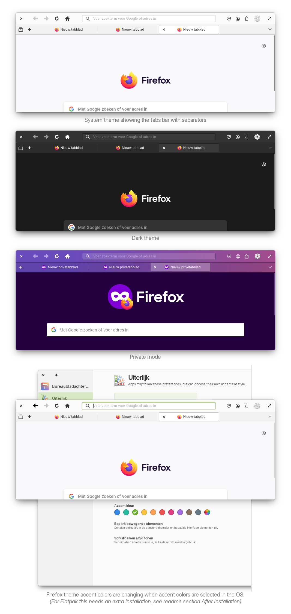

# An elementary OS theme for Firefox

## 🙏 Credits

Credits to [Harvey Cabaguio](https://github.com/harveycabaguio/firefox-elementary-theme) for setting the theme up, [sempasha](https://github.com/sempasha) and [Ryo Nakano](https://github.com/ryonakano) for the install script and the elementary team for the UI design and icons.

## ⬇️ Install

For now theme installation is supported for:

1. [🦊 Firefox 📦 Flatpak version](https://flathub.org/apps/details/org.mozilla.firefox).
2. [🐺 Librewolf 📦 Flatpak version](https://flathub.org/apps/details/io.gitlab.librewolf-community).
3. [🦊 Firefox 📦 download package](https://www.mozilla.org/en-US/firefox/new/).

**You can use Main menu to create a Firefox desktop entry:**
- Download Firefox from the [website](https://www.mozilla.org/en-US/firefox/new/) and extract in a folder of your choice.
- Open [Main menu](https://flathub.org/apps/page.codeberg.libre_menu_editor.LibreMenuEditor) (install it in AppCenter), click on the Settings wheel in the app list on the top right and select `New launcher`.
- Fill in each section starting with Icon. Press the search glass and go to your Firefox folder `browser/chrome/icons/default` and select `default256.png`.
- Under that section you can fill in `Firefox` as name of the launcher.
- Under `Execute > Command` you fill in your Firefox folder location like `home/<username>/Apps/firefox/firefox` where the last "firefox" is the run file.
- You can toggle "show this application in the main menu" `on`.
- Then under that you can choose in which category the launcher is showing like `Internet`.
- Then you can toggle animation `on` too.
- Save by clicking the `save` button in the top bar of the window.

**Now you need a dot under the Firefox icon when opened in the dock. Edit the desktop entry file:**
- In the left list of Main menu, select Firefox icon and click on the Settings wheel and select `Edit document`, this opens Code with the desktop entry file visible.
- Then open Firefox and Terminal.
- Type `xprop WM_CLASS` in the Terminal, the result: your mouse cursor changes into a crosshair.
- You can now click your crosshair cursor on the Firefox window and you will see the WM_Class of Firefox in Terminal.
- Go to Code and type a new line in the `Desktop Entry` section, something like: `StartupWMClass=firefox`. Code will automatically save the file so just close all and move the Firefox icon from Slingshot to the Dock and enjoy the fully working and integrated Firefox.

❗*For other versions of Firefox, like Tor Browser for example, the theme needs to be installed manually. [We welcome contributions](https://github.com/Zonnev/elementaryos-firefox-theme/blob/elementaryos-firefox-theme/CONTRIBUTING.md) like editing a userChrome,*
*for example to make a fully supported other version possible. Thanks in advance.*

Use this one line install script. Just copy the line to your terminal and press enter. When you want a different window control layout, use [Pantheon Tweaks](https://github.com/pantheon-tweaks/pantheon-tweaks/) first to select one, after that this script will automatically install the right userChrome:

```bash
bash <(wget --quiet --output-document - "https://raw.githubusercontent.com/Zonnev/elementaryos-firefox-theme/elementaryos-firefox-theme/install.sh")
```

To force installation of Titlebar Enabled Theme, use script below:

```bash
bash <(wget --quiet --output-document - "https://raw.githubusercontent.com/Zonnev/elementaryos-firefox-theme/elementaryos-firefox-theme/install.sh") --native-titlebar yes
```

Installation script will also patch Firefox preference to enable native titlebar usage.
Firefox doesn't use native titlebar by default.

To force installation of Private Mode Style, use script:

```bash
bash <(wget --quiet --output-document - "https://raw.githubusercontent.com/Zonnev/elementaryos-firefox-theme/elementaryos-firefox-theme/install.sh") --private-mode-style
```

This will make purple colors of Private Mode as default style.

## ➕ After installation

1. In the customization panel in Firefox you can move the new tab button to the left. The default is System theme, you can also use the Dark theme option but Light theme is not supported.
2. In `about:config` you can make the bottom window corners rounded by setting `widget.gtk.rounded-bottom-corners.enabled` to `true`.
3. If you installed the **Flatpak** version of Firefox and you want to make use of the elementary OS **accent colors**, you have to copy the `usr/share/themes` folder to `home/.themes`:
  - Type or copy-paste in Terminal `mkdir -p $HOME/.themes` to make the folder.
  - Then type `cp -r /usr/share/themes/* $HOME/.themes/` to copy the folder and place the files in the folder you have made.
  - And after that `flatpak override --user org.mozilla.firefox --filesystem=$HOME/.themes` to make Flatpak version follow the elementary OS style sheets in the folder.

## 🔁 Update

To update installed theme, use script

```bash
bash <(wget --quiet --output-document - "https://raw.githubusercontent.com/Zonnev/elementaryos-firefox-theme/elementaryos-firefox-theme/install.sh") --update
```

## ✖️ Uninstall this theme

To uninstall this theme, do the following:
1. Type `about:config` in the address bar of Firefox.
2. Search for `toolkit.legacyUserProfileCustomizations.stylesheets` and put it on `false`.
Then restart the browser: the browser does not show the theme anymore.

You can now delete the `chrome` folder(s) by doing the following:
1. Type `about:profiles` in the address bar of Firefox and find your profile folder(s).
2. Delete the `chrome` folder in your profile folder(s).
After this you have completely uninstalled the theme.
